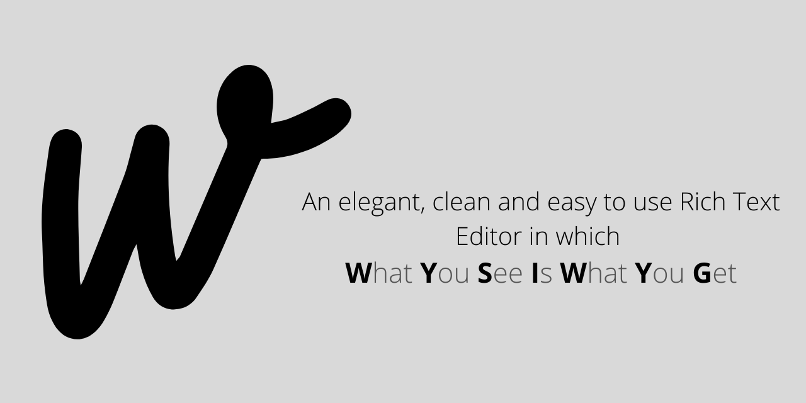

# WYSIWYG

A rich text editor in which "What You See Is What You Get"

**backColor**
Changes the document background color. In styleWithCss mode, it affects the background color of the containing block instead. This requires a &lt;color&gt; value string to be passed in as a value argument. Note that Internet Explorer uses this to set the text background color.

**bold**
Toggles bold on/off for the selection or at the insertion point. Internet Explorer uses the &lt;strong&gt; tag instead of &lt;b&gt;.

**contentReadOnly**
Makes the content document either read-only or editable. This requires a boolean true/false as the value argument. (Not supported by Internet Explorer.)

**copy**
Copies the current selection to the clipboard. Conditions of having this behavior enabled vary from one browser to another, and have evolved over time. Check the compatibility table to determine if you can use it in your case.

**createLink**
Creates an hyperlink from the selection, but only if there is a selection. Requires a URI string as a value argument for the hyperlink's href. The URI must contain at least a single character, which may be whitespace. (Internet Explorer will create a link with a null value.)

**cut**
Removes the current selection and copies it to the clipboard. When this behavior is enabled varies between browsers, and its conditions have evolved over time. Check the compatibility table for usage details.

**decreaseFontSize**
Adds a &lt;small&gt; tag around the selection or at the insertion point. (Not supported by Internet Explorer.)

**defaultParagraphSeparator**
Changes the paragraph separator used when new paragraphs are created in editable text regions. See Differences in markup generation for more details.

**delete**
Deletes the current selection.

**enableAbsolutePositionEditor**
Enables or disables the grabber that allows absolutely-positioned elements to be moved around. This is disabled by default in Firefox 63 Beta/Dev Edition (bug 1449564)

**enableInlineTableEditing**
Enables or disables the table row/column insertion and deletion controls. This is disabled by default in Firefox 63 Beta/Dev Edition (bug 1449564).

**enableObjectResizing**
Enables or disables the resize handles on images, tables, and absolutely-positioned elements and other resizable objects. This is disabled by default in Firefox 63 Beta/Dev Edition (bug 1449564).

**fontName**
Changes the font name for the selection or at the insertion point. This requires a font name string (like "Arial") as a value argument.

**fontSize**
Changes the font size for the selection or at the insertion point. This requires an integer from 1-7 as a value argument.

**foreColor**
Changes a font color for the selection or at the insertion point. This requires a hexadecimal color value string as a value argument.

**formatBlock**
Adds an HTML block-level element around the line containing the current selection, replacing the block element containing the line if one exists (in Firefox, &lt;blockquote&gt; is the exception — it will wrap any containing block element). Requires a tag-name string as a value argument. Virtually all block-level elements can be used. (Internet Explorer and Edge support only heading tags H1–H6, ADDRESS, and PRE, which must be wrapped in angle brackets, such as "H1")

**forwardDelete**
Deletes the character ahead of the cursor's position, identical to hitting the Delete key on a Windows keyboard.

**heading**
Adds a heading element around a selection or insertion point line. Requires the tag-name string as a value argument (i.e. "H1", "H6"). (Not supported by Internet Explorer and Safari.)

**hiliteColor**
Changes the background color for the selection or at the insertion point. Requires a color value string as a value argument. useCSS must be true for this to function. (Not supported by Internet Explorer.)

**increaseFontSize**
Adds a &lt;big&gt; tag around the selection or at the insertion point. (Not supported by Internet Explorer.)

**indent**
Indents the line containing the selection or insertion point. In Firefox, if the selection spans multiple lines at different levels of indentation, only the least indented lines in the selection will be indented.

**insertBrOnReturn**
Controls whether the Enter key inserts a &lt;br&gt; element, or splits the current block element into two. (Not supported by Internet Explorer.)

**insertHorizontalRule**
Inserts a &lt;hr&gt; element at the insertion point, or replaces the selection with it.

**insertHTML**
Inserts an HTML string at the insertion point (deletes selection). Requires a valid HTML string as a value argument. (Not supported by Internet Explorer.)

**insertImage**
Inserts an image at the insertion point (deletes selection). Requires a URL string for the image's src as a value argument. The requirements for this string are the same as createLink.

**insertOrderedList**
Creates a numbered ordered list for the selection or at the insertion point.

**insertUnorderedList**
Creates a bulleted unordered list for the selection or at the insertion point.

**insertParagraph**
Inserts a paragraph around the selection or the current line. (Internet Explorer inserts a paragraph at the insertion point and deletes the selection.)

**insertText**
Inserts the given plain text at the insertion point (deletes selection).

**italic**
Toggles italics on/off for the selection or at the insertion point. (Internet Explorer uses the &lt;em&gt; element instead of &lt;i&gt;)

**justifyCenter**
Centers the selection or insertion point.

**justifyFull**
Justifies the selection or insertion point.

**justifyLeft**
Justifies the selection or insertion point to the left.

**justifyRight**
Right-justifies the selection or the insertion point.

**outdent**
Outdents the line containing the selection or insertion point.

**paste**
Pastes the clipboard contents at the insertion point (replaces current selection). Disabled for web content. See [1].

**redo**
Redoes the previous undo command.

**removeFormat**
Removes all formatting from the current selection.

**selectAll**
Selects all of the content of the editable region.

**strikeThrough**
Toggles strikethrough on/off for the selection or at the insertion point.

**subscript**
Toggles subscript on/off for the selection or at the insertion point.

**superscript**
Toggles superscript on/off for the selection or at the insertion point.

**underline**
Toggles underline on/off for the selection or at the insertion point.

**undo**
Undoes the last executed command.

**unlink**
Removes the anchor element from a selected hyperlink.

**useCSS**
Toggles the use of HTML tags or CSS for the generated markup. Requires a boolean true/false as a value argument. NOTE: This argument is logically backwards (i.e. use false to use CSS, true to use HTML) and unsupported by Internet Explorer. This has been deprecated in favor of styleWithCSS.

**styleWithCSS**
Replaces the useCSS command. true modifies/generates style attributes in markup, false generates presentational elements.

Made with ️❤︎ by **[Abhijeet](https://abhijeetsaxena.in/ 'Abhijeet Saxena')**
